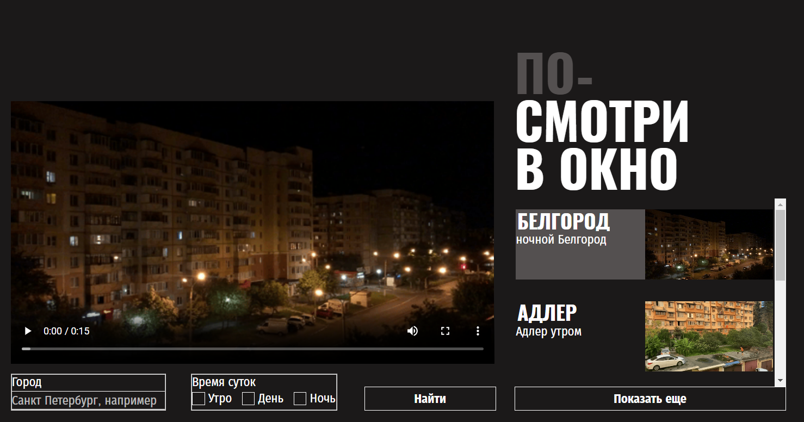
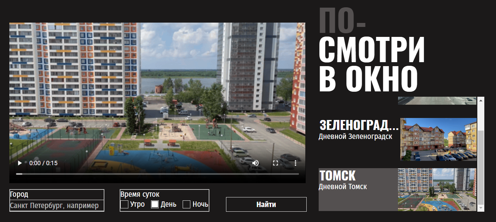
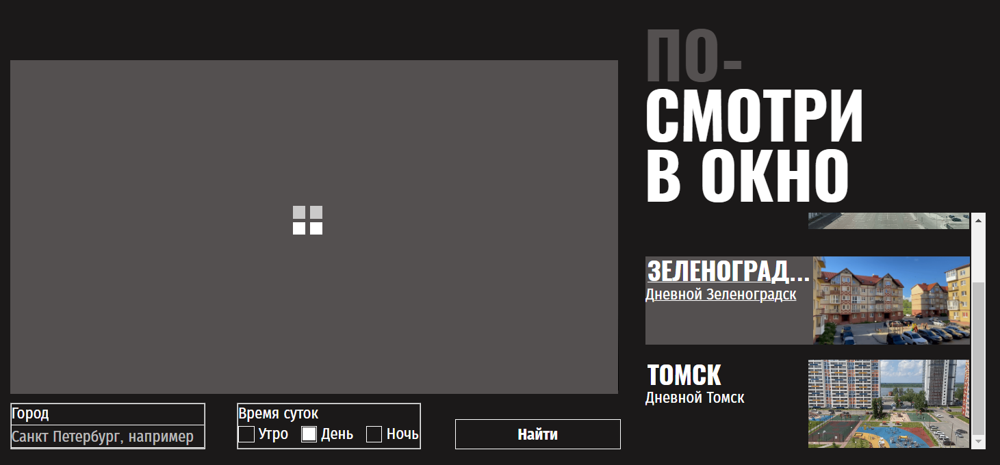
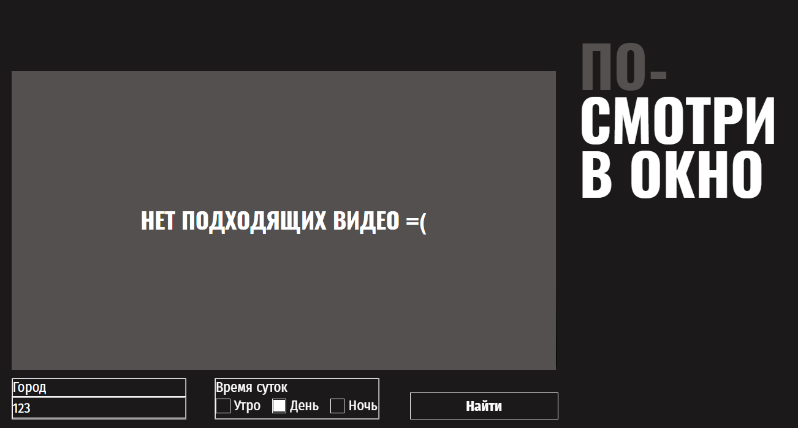

# Проектная работа "ПОСМОТРИ В ОКНО".
Суть работы заключается в верстке страницы, с использованием псевдоклассов и псевдоэлементов, стилизацией форм и позиционированием прелоадеров.
## В ходе проекта я:
проанализировала макет;
выполнила общие настройки;
сверстала все необходимые секции.
## Результат работы.

